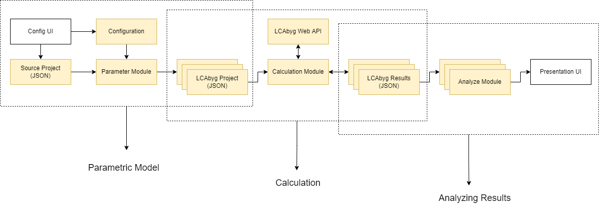
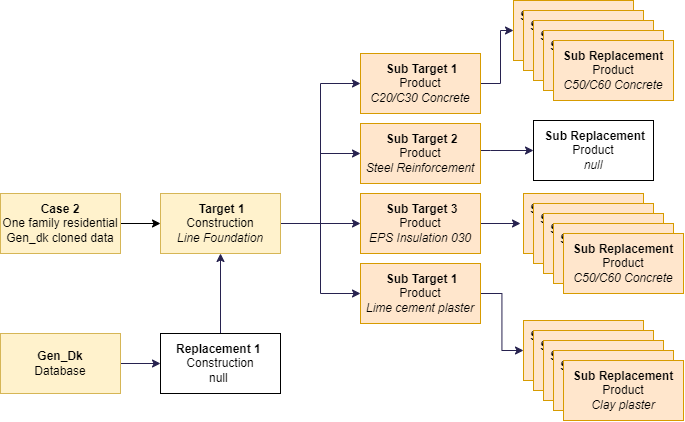
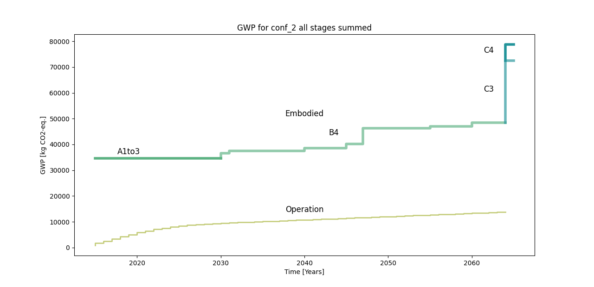

[![AGPL License][license-shield]][license-url]

[![lcabyg][lcabyg-shield]][lcabyg-url]

[![LinkedIn][linkedin-shield-lhv]][linkedin-url-lhv]

[![LinkedIn][linkedin-shield-tpa]][linkedin-url-tpa]


<!-- PROJECT LOGO -->
<br />
<div align="center">
  <a href="https://github.com/build-aau/parmesan">
    
  </a>

<h3 align="center">Parmesan</h3>

  <p align="center">
    Tool for flexible LCA analysis of buildings
    <br />
    <a href="https://github.com/build-aau/parmesan"><strong>Explore the docs »</strong></a>
    <br />
    <br />
    <a href="https://github.com/build-aau/parmesan/pulls">Pull requests</a>
    ·
    <a href="https://github.com/build-aau/parmesan/issues">Report Bug</a>
    ·
    <a href="https://github.com/build-aau/parmesan/issues">Request Feature</a>
  </p>
</div>


<!-- TABLE OF CONTENTS -->
<details>
  <summary>Table of Contents</summary>
  <ol>
    <li>
      <a href="#about-the-project">About The Project</a>
    </li>
    <li>
      <a href="#getting-started">Getting Started</a>
      <ul>
        <li><a href="#prerequisites">Prerequisites</a></li>
        <li><a href="#installation">Installation</a></li>
      </ul>
    </li>
    <li><a href="#usage">Concept</a></li>
    <li><a href="#usage">Usage</a></li>
    <li><a href="#roadmap">Roadmap</a></li>
    <li><a href="#contributing">Contributing</a></li>
    <li><a href="#license">License</a></li>
    <li><a href="#contact">Contact</a></li>
    <li><a href="#acknowledgments">Acknowledgments</a></li>
  </ol>
</details>


<!-- ABOUT THE PROJECT -->
## About The Project

The goal is to develop tools that will allow the user to perform LCA analysis in a 
more dynamic and parametric way.

The project is a 3-week course performed by Lærke Høvsgaard Vejsnæs and Terese Pagh, both
Architectural Engineering master students at the Technical University of Denmark.

This is done in collaboration with the research department BUILD, at Aalborg University.
BUILD is the developer of LCAbyg Web API, which is used to compute the LCA results. 
It is the beginning of a bigger project which will lead up to our thesis project in fall 2022.

As we are architectural engineering students our expertise lies in LCA analysis of buildings, but we are very passionate about 
digital tools that can help make the building industry become more efficient.

The code is built with the intent to implement a user interface with required user inputs. At present, hardcoded variables performs as placeholders for imaginary user inputs. 

We will be updating and adding to this repository frequently and we will very much appreciate comments and suggestions 
if anyone is interested. 

<p align="right">(<a href="#top">back to top</a>)</p>


<!-- GETTING STARTED -->
## Getting Started
If you are not familiar with the data structure of LCAbyg JSON we recommend that you read the LCAbyg JSON
user guide first and watch some of LCAbyg's YouTube webinars on how to use JSON. 
[Download](https://www.lcabyg.dk/da/usermanual/brugervejledning-andre-vaerktojer/) the LCAbyg manual or 
watch our JSON webinars [here](https://www.youtube.com/watch?v=KLitrgl8OhY&list=PLzSTwx1m_PoFXkleYcvKrJoKyaGh76mLQ&index=1).

We are currently working on making the LCAbyg Web API public. Until then, it is only possible to view 
the parameterization and calculation modules. 

The analysis module is open for testing. We have provided example data "case 2" for you to test the analysis scripts with.

### Prerequisites

1. Clone the repo
   ```sh
   git clone https://github.com/build-aau/parmesan.git
   ```
2. Install the Python version 3.10 and poetry [poetry](https://python-poetry.org/)

3. install packages from poetry [pyproject.toml](pyproject.toml)


<p align="right">(<a href="#top">back to top</a>)</p>


<!-- CONCEPT -->
## Concept

The diagram below shows the workflow for the project in its current stage. It is organized into three 
main modules: parametric, calculation, analyzing. This makes it possible to work and use each section independently.

Until now, we have developed the highlighted modules.



The source project must be an LCAbyg-structured building project in the JSON format.

The user must also create a configurations_input.json file with the nodes to be replaced and the nodes to replace with. 
From this, the script generate_configurations.py automatically generates a list of configurations 
for each version of the building project. 




<p align="right">(<a href="#top">back to top</a>)</p>

<!-- USAGE EXAMPLE -->
## Usage Example

We have provided an example dataset for a simple building project named "case 2", containing five different building 
configurations. 

Until access to the LCAbyg web API is acquired the calculated results for case 2 are located in [case2_results_collected.json](res/api_saved_res/output_case2_conf_gen2/case2_results_collected.json)
This can be used to run any of the scripts from the analysis module of the workflow without access to the LCAbyg Web API. 

The processing of the LCA results and the layout of the graphs can be designed as desired and can handle the
comparison of different versions of a building.

####Examples of types of graphs generated from the scrips are:

The many versions of the hotspot, seen in hotspot diagram, allow a look into the main contributors to the impact of the building configurations.
This type of graph can show the hotspot for building elements, constructions, and products, with or without splitting
the results into stages. These options provide a detailed comparison of the building configurations.


The different versions of the accumulated graphs give a time perspective.
This type of graph can show the results over time for one or all configurations. These are split up
into embodied and operation. The embodied impact can be shown as the sum or split up into stages to further detail the 
 lifecycle of the building.


<!-- ROADMAP -->
## Roadmap

- [x] Source Case Projects (JSON)
   - [x] Case 1 (incl. constructions) w/Example data
   - [x] Case 2 (incl. constructions and products) w/Example data

- [x] Configuration input files (.py)
  - [x] configurations_input_case_1 
  - [x] configurations_input_case_2 
    - [ ] configurations_input_case_2b (create better use case examples)
      - [ ] Automatic find id's for children within parents
      - [ ] Test comparison of two different cases with different instance id's
  
- [x] Parameter module (.py)
  - [x] Case 1 LCAbyg Project configurations (JSON)
  - [x] Case 2 LCAbyg Project configurations (JSON)

- [x] Calculation module
  - [x] Implementation of LCAbyg Web API

- [ ] Analysis modules
  - [x] Restructuring of API output data to the tree structure
  - [x] Templates for analysis and plot w/ Examples
    - [x] Template for visual style - (see hotspot.py)
    - [ ] Template materials group analysis and plot w/ Examples
    - [ ] Hotspots analysis where indicator categories are stacked instead of stages
  - [ ] Template sensitivity analysis w/ Examples
  - [ ] Unit checker and helper w/ Examples
  - [ ] Include and handle stage D
  - [ ] Implement visual style for all analysis modules
  - [ ] Implement module for exporting selected data to csv
  

- [ ] User interface in a webpage
  - [ ] Configuration UI 
  - [ ] Presentation UI (with interactive features for in-depth analysis)
    - [ ] Test using .svg, dropdown menus, etc. 
    - [ ] Online interactive dashboard?

- [ ] Integration with other tools
  - [ ] Include (semi-) automatic conversion of IFC data to LCAbyg JSON data
  - [ ] Think through and devise concrete examples of how the tool can interact with other API's
  - [ ] Reflect and test how the data structure can be built up differently (without JSON)
  

<p align="right">(<a href="#top">back to top</a>)</p>


<!-- CONTRIBUTING -->
## Contributing

If you have a suggestion that would make this better, you are welcome to create a [pull request](https://github.com/build-aau/parmesan/pulls).


<p align="right">(<a href="#top">back to top</a>)</p>


<!-- LICENSE -->
## License

Distributed under the AGPL License. See [LICENSE.md](LICENSE.md) for more information.

<p align="right">(<a href="#top">back to top</a>)</p>


<!-- CONTACT -->
## Contact

* Lærke Høvsgaard Vejsnæs: [lhv@build.aau.dk](mailto:lhv@build.aau.dk)
* Terese Pagh: [tpa@build.aau.dk](mailto:tpa@build.aau.dk)

<p align="right">(<a href="#top">back to top</a>)</p>


<!-- ACKNOWLEDGMENTS -->
## Acknowledgments

* Christian Grau Sørensen, AAU
* Simone Bruhn, AAU
* Tim Pat McGinley, DTU

[https://api.lcabyg.dk/](https://api.lcabyg.dk/ "https://api.lcabyg.dk/")


body {
    background: #DDDDDD;
    color: #888888;
    font-size: 250% !important;
}

<p align="right">(<a href="#top">back to top</a>)</p>


<!-- MARKDOWN LINKS & IMAGES -->
<!-- https://www.markdownguide.org/basic-syntax/#reference-style-links -->
[contributors-shield]: https://img.shields.io/github/contributors/github_username/repo_name.svg?style=for-the-badge
[contributors-url]: https://github.com/github_username/repo_name/graphs/contributors
[forks-shield]: https://img.shields.io/github/forks/github_username/repo_name.svg?style=for-the-badge
[forks-url]: https://github.com/github_username/repo_name/network/members
[stars-shield]: https://img.shields.io/github/stars/github_username/repo_name.svg?style=for-the-badge
[stars-url]: https://github.com/github_username/repo_name/stargazers
[issues-shield]: https://img.shields.io/github/issues/github_username/repo_name.svg?style=for-the-badge
[issues-url]: https://github.com/github_username/repo_name/issues
[license-shield]: https://img.shields.io/badge/LICENSE-GNU%20AGPL-lightgrey?style=for-the-badge&logo=gnu
[license-url]: https://www.gnu.org/licenses/agpl-3.0.en.html
[linkedin-shield-tpa]: https://img.shields.io/badge/-LinkedIn-black.svg?style=for-the-badge&logo=linkedin&colorB=555
[linkedin-url-tpa]: https://www.linkedin.com/in/terese-pagh-a346361ab/
[linkedin-shield-lhv]: https://img.shields.io/badge/-LinkedIn-black.svg?style=for-the-badge&logo=linkedin&colorB=555
[linkedin-url-lhv]: https://www.linkedin.com/in/l%C3%A6rke-vejsn%C3%A6s-3337461b6/
[product-screenshot]: images/screenshot.png
[lcabyg-shield]: https://img.shields.io/badge/Website-LCAbyg-green?style=for-the-badge
[lcabyg-url]: https://lcabyg.dk/da/

